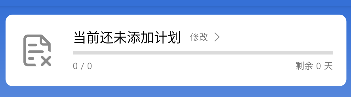
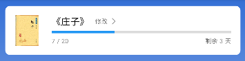

# App简易使用文档

## 注册登录

初始进入App需要执行登录操作，若没有账户则需要进行注册

### 注册

点击注册按钮进入注册页面，输入合法手机号和密码，完成注册

### 登录

输入注册过的手机号和密码，完成登录

## 首页

首页页面包含了软件的基础功能

### 学习日历

点击右上角的日历进入学习日历

学习日历中可以查看之前的学习（打卡）记录

对于学习记录中的每个字词可以点击查看释义、出处和翻译

### 计划

初始状态下显示当前未添加计划

点击后进入**我的图书**页面（此时我的图书为空）

若已经添加计划，则会显示当前计划进度

点击后进入**学习计划**页面

#### 学习计划

可改变每天背单词的数量，同时也可以重置计划（重新开始背单词）

### 开始学习

若当天计划没有完成则显示**开始学习吧！**的碎片，点击即可开始今日的学习

若当天计划已完成则显示**打卡**的碎片，点击即可进行打卡

#### 学习页面

将首先给出当日需复习的字词，其次给出当日需新学的字词

根据所给的选项选择所给字词的正确含义，只有完成了本题（不论答对答错）才可以进入下一题。若答对则题目不再出现，若答错则题目将在最后重新出现，直到答对为止

题目卡片的右上角五角星可以**收藏单词**

**当前数据库中只有《庄子》和《阅微草堂笔记》中含有题目**

#### 打卡页面

点击完成今日打卡，不可重复打卡

### 每日一句

展示每日一句（数据库内数据展示到12月26日）

### 小课堂

展示古韵小课堂，内含古韵屋官方发布的文章，文章可**点赞留言**

### 古韵活动

展示古韵活动，目前为空

### 字词本

展示用户收藏的字词，可点击**学习**进行学习

对于学字词本中的每个字词可以点击查看释义、出处和翻译

## 发现

发现页面展示用户发布的文章，文章可**点赞留言**

点击下方中心的**+**可自行发布文章：支持**上传封面**（相机或相册选择），添加标题

正文内容支持加粗、斜体、下划线、删除线、引用、超链接。右上角支持撤销、重做

点击**发送**即可发布文章

## 用户

用户页面展示基本的用户信息

### 我的图书

我的图书中展示了所有已选的图书，可选择自己感兴趣的图书并**切换图书**，即切换计划到这本书，若已经选择则显示**已选择**

点击右上角**+**添加图书，可进入**图书馆**页面

#### 图书馆

图书馆中展示了所有可选的图书，可选择自己感兴趣的图书并**添加图书**，若已经添加则显示**已添加**

### 我的收藏

点击进入**单词本**页面

### 夜间模式

点击切换夜间模式 / 日间模式

### 帮助与反馈

点击进入仓库issue页面

### 设置

#### 学习提醒

点击可选择是否每日提醒（Notification），同时可修改每日提醒时间

#### 学习设置

点击可选择是否例句显示中文翻译（学习页面）

#### 隐私设置

##### 系统权限设置

点击进入系统设置页面

##### 个性化推送

未实现

##### 账号资料

点击进入**个人资料**，可修改头像（相机或相册选择）、昵称、性别和出生日期

#### 关于我们

点击进入仓库主页

#### 退出登录

退出登录，回到初始页面

